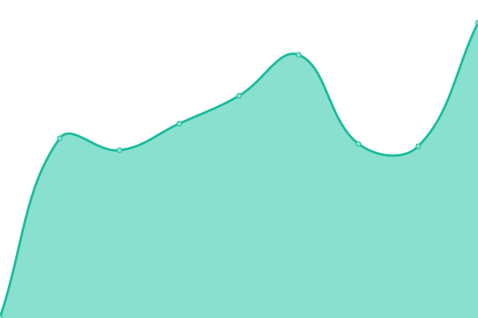
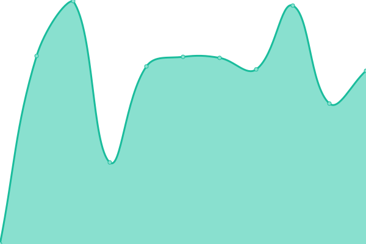

# [📈 Live Status](https://clickdealer.github.io/upptime): <!--live status--> **🟩 All systems operational**

This repository contains the open-source uptime monitor and status page for [Click Dealer](https://clickdealer.co.uk), powered by [Upptime](https://github.com/upptime/upptime).

With [Upptime](https://upptime.js.org), you can get your own unlimited and free uptime monitor and status page, powered entirely by a GitHub repository. We use [Issues](https://github.com/clickdealer/upptime/issues) as incident reports, [Actions](https://github.com/clickdealer/upptime/actions) as uptime monitors, and [Pages](https://clickdealer.github.io/upptime) for the status page.

<!--start: status pages-->
<!-- This summary is generated by Upptime (https://github.com/upptime/upptime) -->
<!-- Do not edit this manually, your changes will be overwritten -->

| URL                                                | Status | History                                                                                            | Response Time                                                                     | Uptime                                                                                                                                                                                                                            |
| -------------------------------------------------- | ------ | -------------------------------------------------------------------------------------------------- | --------------------------------------------------------------------------------- | --------------------------------------------------------------------------------------------------------------------------------------------------------------------------------------------------------------------------------- |
| [Click DMS](https://myclickdealer.co.uk)           | 🟩 Up  | [click-dms.yml](https://github.com/clickdealer/upptime/commits/master/history/click-dms.yml)       |  1570ms   |         |
| [Click Engage](https://example.click-engage.co.uk) | 🟩 Up  | [click-engage.yml](https://github.com/clickdealer/upptime/commits/master/history/click-engage.yml) |  553ms |  |
| [Click Media +](https://api.myclickdealer.co.uk)   | 🟩 Up  | [click-media.yml](https://github.com/clickdealer/upptime/commits/master/history/click-media.yml)   |  575ms  |    |
| [Click Web](https://www.clickmotors.co.uk)         | 🟩 Up  | [click-web.yml](https://github.com/clickdealer/upptime/commits/master/history/click-web.yml)       |  1064ms   |        |

<!--end: status pages-->

[**Visit our status website →**](https://clickdealer.github.io/upptime)

## 📄 License

- Code: [MIT](./LICENSE) © [Click Dealer](https://clickdealer.co.uk)
- Data in the `./history` directory: [Open Database License](https://opendatacommons.org/licenses/odbl/1-0/)
