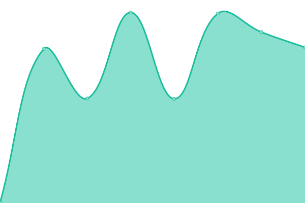

# [📈 Live Status](https://clickdealer.github.io/upptime): <!--live status--> **🟧 Partial outage**

This repository contains the open-source uptime monitor and status page for [Click Dealer](https://clickdealer.co.uk), powered by [Upptime](https://github.com/upptime/upptime).

With [Upptime](https://upptime.js.org), you can get your own unlimited and free uptime monitor and status page, powered entirely by a GitHub repository. We use [Issues](https://github.com/clickdealer/upptime/issues) as incident reports, [Actions](https://github.com/clickdealer/upptime/actions) as uptime monitors, and [Pages](https://clickdealer.github.io/upptime) for the status page.

<!--start: status pages-->
<!-- This summary is generated by Upptime (https://github.com/upptime/upptime) -->
<!-- Do not edit this manually, your changes will be overwritten -->
<!-- prettier-ignore -->
| URL | Status | History | Response Time | Uptime |
| --- | ------ | ------- | ------------- | ------ |
|  [Click DMS](https://myclickdealer.co.uk) | 🟩 Up | [click-dms.yml](https://github.com/clickdealer/upptime/commits/master/history/click-dms.yml) | 

 970ms
     
 | 

<a href="https://clickdealer.github.io/upptime/history/click-dms">97.37%</a>
    

|  [Click Engage](https://example.click-engage.co.uk) | 🟩 Up | [click-engage.yml](https://github.com/clickdealer/upptime/commits/master/history/click-engage.yml) | 

 1282ms
     
 | 

<a href="https://clickdealer.github.io/upptime/history/click-engage">97.72%</a>
    

|  [Click Media +](https://api.myclickdealer.co.uk) | 🟩 Up | [click-media.yml](https://github.com/clickdealer/upptime/commits/master/history/click-media.yml) | 

 1432ms
     
 | 

<a href="https://clickdealer.github.io/upptime/history/click-media">97.72%</a>
    

|  [Click Web (AWS - 13.248.163.118)](https://13.248.163.118) | 🟩 Up | [click-web-aws-13-248-163-118.yml](https://github.com/clickdealer/upptime/commits/master/history/click-web-aws-13-248-163-118.yml) | 

 861ms
     
 | 

<a href="https://clickdealer.github.io/upptime/history/click-web-aws-13-248-163-118">98.06%</a>
    

|  [Click Web (AWS - 76.223.62.13)](https://76.223.62.13) | 🟥 Down | [click-web-aws-76-223-62-13.yml](https://github.com/clickdealer/upptime/commits/master/history/click-web-aws-76-223-62-13.yml) | 

 1107ms
     
 | 

<a href="https://clickdealer.github.io/upptime/history/click-web-aws-76-223-62-13">97.75%</a>
    

|  [Click Web (UKFast - 185.166.128.248)](https://185.166.128.248) | 🟥 Down | [click-web-uk-fast-185-166-128-248.yml](https://github.com/clickdealer/upptime/commits/master/history/click-web-uk-fast-185-166-128-248.yml) | 

 740ms
     
 | 

<a href="https://clickdealer.github.io/upptime/history/click-web-uk-fast-185-166-128-248">93.03%</a>
    

<!--end: status pages-->

[**Visit our status website →**](https://clickdealer.github.io/upptime)

## 📄 License

- Code: [MIT](./LICENSE) © [Click Dealer](https://clickdealer.co.uk)
- Data in the `./history` directory: [Open Database License](https://opendatacommons.org/licenses/odbl/1-0/)
